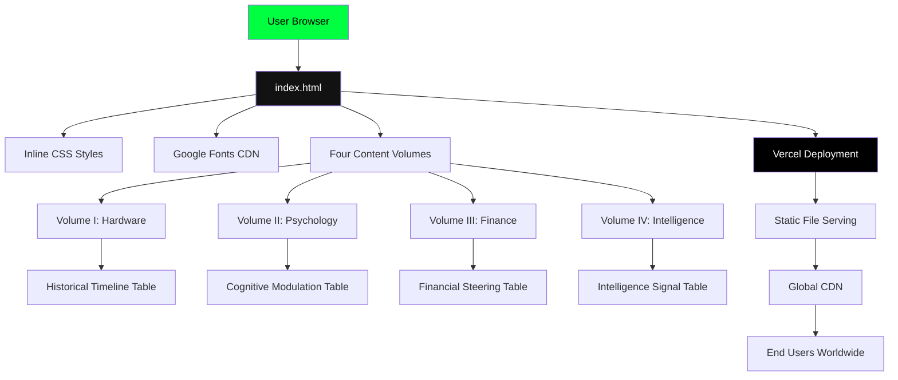
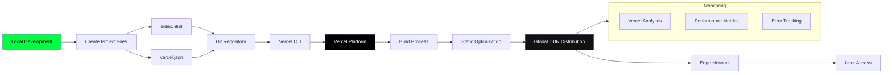

# Steersman Briefing Project Plan

## Project Overview
The "Steersman Briefing" is a web-based interface presenting "The Architecture of the Steersman: A 5,000-Year Genealogy of the Control State." It's a forensic audit visualization with a cyberpunk/terminal aesthetic.

## Project Structure
```
steersman-briefing/
├── index.html          # Main HTML file with inline CSS
├── vercel.json         # Vercel deployment configuration
└── README.md           # Project documentation (optional)
```

## File Specifications

### 1. index.html
**Content**: The provided HTML code with:
- Complete inline CSS styling using CSS custom properties
- Four main volumes (Hardware, Psychology, Finance, Intelligence)
- Historical timeline tables with era tags
- Shadow manuals sections
- Convergence section
- Responsive design with grid layout

**Key Features**:
- Dark theme with terminal green accent (#00ff41)
- JetBrains Mono and Inter fonts from Google Fonts
- Responsive navigation grid
- Section-based layout with visual indicators
- Historical data tables with timeline tags

### 2. vercel.json
**Configuration**:
```json
{
  "version": 2,
  "name": "steersman-architecture",
  "builds": [
    { "src": "index.html", "use": "@vercel/static" }
  ],
  "routes": [
    { "src": "/(.*)", "dest": "/index.html" }
  ]
}
```

**Purpose**: Configures Vercel to:
- Serve the project as a static site
- Use the `@vercel/static` builder for HTML files
- Route all requests to index.html (SPA-style routing)

## Technical Architecture

### System Architecture Diagram



### Design System
- **Color Palette**: Dark background (#0a0a0a), surface (#121212), terminal green accent (#00ff41)
- **Typography**: JetBrains Mono for monospace, Inter for body text
- **Layout**: Max-width container (1100px) with responsive grid
- **Visual Hierarchy**: Section borders, accent markers, and tag styling

### Responsive Considerations
- Grid layout with `repeat(auto-fit, minmax(200px, 1fr))`
- Mobile-friendly padding and font sizes
- Flexible table layouts for smaller screens

## Deployment Strategy

### Vercel Deployment
1. **Framework**: Static HTML (no build process required)
2. **Build Command**: None (static files)
3. **Output Directory**: Root (single HTML file)
4. **Routing**: All paths redirect to index.html for potential future client-side routing

### Deployment Steps
```bash
# 1. Initialize Git repository
git init
git add .
git commit -m "Initial commit: Steersman Briefing"

# 2. Deploy to Vercel
vercel --prod
```

### Deployment Workflow Diagram



## Future Enhancements

### Phase 1: Immediate Improvements
1. **External CSS**: Move inline styles to `styles.css` for better maintainability
2. **JavaScript Interactivity**: Add smooth scrolling for navigation links
3. **Asset Optimization**: Compress and optimize any future images

### Phase 2: Advanced Features
1. **Interactive Timeline**: Make the historical timeline clickable with detailed modals
2. **Search Functionality**: Allow searching across all volumes and shadow manuals
3. **Print/Export**: Add PDF export capability for briefing documents
4. **Dark/Light Mode Toggle**: Additional theme options

### Phase 3: Extended Platform
1. **Backend Integration**: Connect to a CMS for dynamic content updates
2. **User Accounts**: Allow personalized briefing collections
3. **API Endpoints**: Expose historical data as JSON for external consumption

## Development Workflow

### Local Development
```bash
# Simple local server
python3 -m http.server 8000
# or
npx serve .
```

### Testing
- **Cross-browser**: Test on Chrome, Firefox, Safari
- **Mobile**: Verify responsive design on various screen sizes
- **Performance**: Lighthouse audit for performance, accessibility, SEO

## Content Structure Analysis

The HTML presents a sophisticated content architecture:

### Volume I: Hardware
- Focus: Physical infrastructure and control mechanisms
- Timeline: 3000 BCE (Nilometer) to 2026 CE (H100/Scale Donovan)
- Key Concept: "Governance in Concrete"

### Volume II: Psychology  
- Focus: Cognitive modulation and internalized control
- Timeline: 3000 BCE (Mystery Schools) to 2026 CE (Project Archetype)
- Key Concept: Self-correcting subjects

### Volume III: Finance
- Focus: Capital as systemic steering mechanism
- Timeline: 2000 BCE (Babylonian Interest) to 2026 CE (Energy-for-Compute)
- Key Concept: "Systemic Delta"

### Volume IV: Intelligence
- Focus: Signal dominance and latency ownership
- Timeline: 1564 CE (John Dee) to 2026 CE (Interoperable Coalitions)
- Key Concept: "Ownership of Latency"

## Accessibility Considerations

### Current Implementation
- Semantic HTML structure with proper headings
- Adequate color contrast (terminal green on dark background)
- Responsive design for various devices

### Recommended Improvements
1. **ARIA Labels**: Add aria-label attributes to navigation items
2. **Keyboard Navigation**: Ensure all interactive elements are keyboard accessible
3. **Screen Reader Optimization**: Add descriptive alt text for any future images
4. **Focus Indicators**: Enhance focus styles for better visibility

## Performance Optimization

### Current Status
- Minimal external dependencies (only Google Fonts)
- Inline CSS reduces HTTP requests
- No JavaScript bloat

### Optimization Opportunities
1. **Font Loading**: Use `font-display: swap` for better performance
2. **CSS Minification**: Minify inline CSS
3. **Lazy Loading**: For any future images or external resources
4. **Caching Headers**: Configure appropriate cache policies on Vercel

## Security Considerations

### Static Site Advantages
- No server-side execution vulnerabilities
- Minimal attack surface
- No database or user input handling

### Recommendations
1. **Content Security Policy**: Implement CSP headers
2. **HTTPS Enforcement**: Vercel provides automatic SSL
3. **Security Headers**: Add HSTS, X-Frame-Options, etc.

## Success Metrics

### Technical Metrics
- Page load time < 2 seconds
- Lighthouse scores > 90
- 100% uptime on Vercel

### User Experience Metrics
- Navigation completion rate
- Time spent per volume
- Return visitor rate

## Maintenance Plan

### Regular Updates
1. **Content Updates**: Modify HTML directly for content changes
2. **Style Updates**: Edit CSS variables for theme adjustments
3. **Deployment**: Push changes to Git, Vercel auto-deploys

### Monitoring
- Vercel analytics for traffic patterns
- Error tracking via Vercel logs
- Performance monitoring with Lighthouse CI

## Conclusion

The Steersman Briefing project is a well-architected static site that effectively presents complex historical analysis through a modern web interface. The current implementation provides a solid foundation with room for iterative enhancement based on user feedback and evolving requirements.

The deployment to Vercel ensures global availability with minimal operational overhead, making this an ideal solution for disseminating the "Architecture of the Steersman" forensic audit to a wide audience.